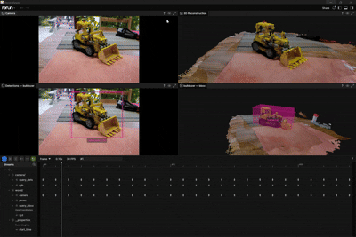
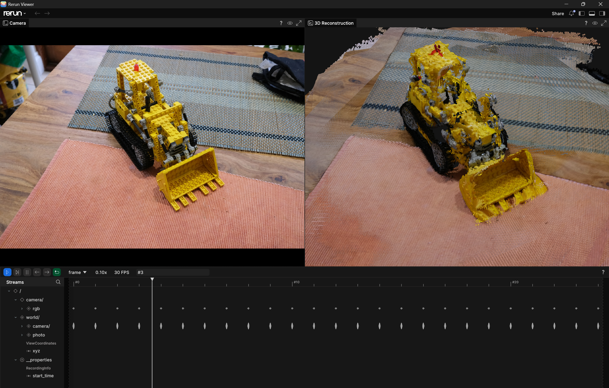
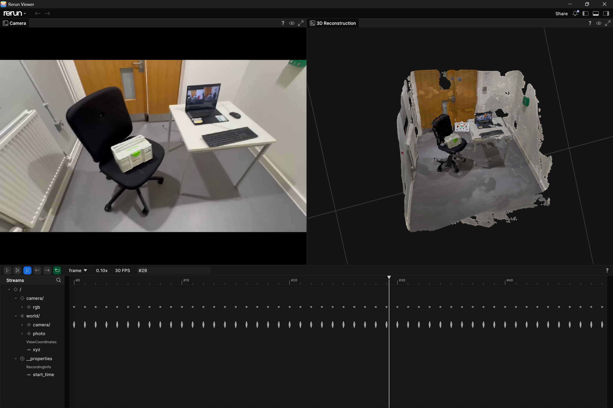
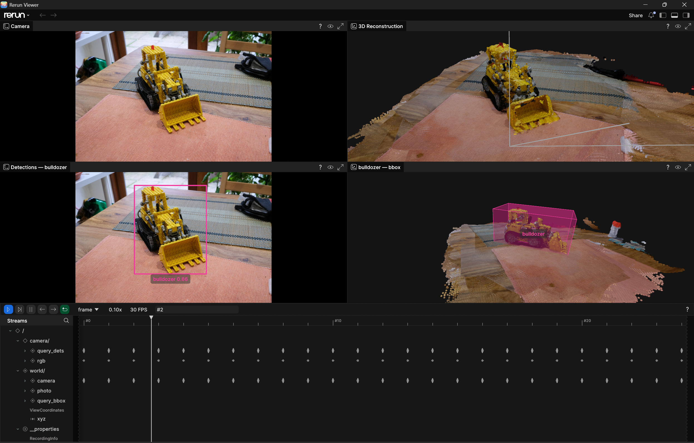
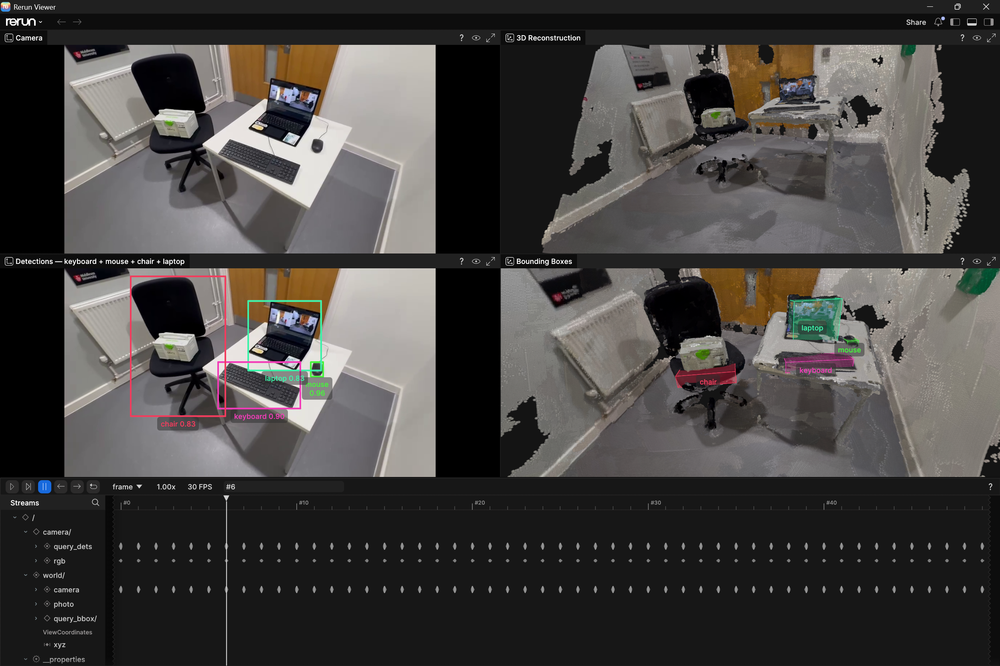

# scene-query

<p align="center">
  
  
  
  
  
  
  
</p>

<p align="center">
  Point a camera at a scene. Ask it where things are.
</p>

<p align="center">
  
  &nbsp;
  
</p>

<p align="center">
  <em>Left: tabletop — querying "find the bulldozer" &nbsp;|&nbsp; Right: office walkthrough — preset scan</em>
</p>

---

**scene-query** takes a video or a folder of images, builds a dense 3D reconstruction, and lets you query it in plain English — *"find the bulldozer"*, *"find the chair"*, *"find the monitor"* — returning a tight 3D bounding box around the object, visualised with a full camera timeline.

No fixed vocabulary. No retraining. Any object you can name, it can find.

> **Reconstruct once, query many times.** `reconstruct.py` is the expensive step — run it once per scene. After that, `query.py` can be run repeatedly on the same scene with different queries, no re-reconstruction needed.

---

## How it works

**Reconstruct** — feed in your images or video. [VGGT-Omega](https://github.com/facebookresearch/vggt-omega) (Meta AI, CVPR 2025) runs a single feed-forward pass and produces camera poses, per-frame depth maps, and a photo-coloured 3D point cloud. No optimisation loop, no SfM pipeline — just one forward pass.

**Query** — ask for any object by name. [Grounding DINO](https://github.com/IDEA-Research/GroundingDINO) (IDEA-Research) detects it across every frame open-vocabulary, [SAM 2](https://github.com/facebookresearch/sam2) (Meta AI) segments it precisely, and the masks are back-projected using VGGT depth to lift the object into 3D. The result is a tight oriented bounding box ready for robot manipulation, navigation, or scene understanding.

A robot that can be asked in plain language where objects are — without pre-programming specific object classes — is far more flexible in real-world environments. That is the problem this solves.

---

## Scenario 1 — just explore my outputs (no GPU needed)

All you need is [Rerun](https://rerun.io) and Git LFS to pull the output files.

```bash
git lfs install
git clone https://github.com/Shuaibu-oluwatunmise/scene-query.git
cd scene-query

pip install rerun-sdk==0.32.1
```

**Tabletop — specific object query:**
```bash
rerun outputs/tabletop/tabletop.rrd           # reconstruction
rerun outputs/tabletop/query_bulldozer.rrd    # bulldozer query
```

**Office — preset scan:**
```bash
rerun outputs/office_scene/reconstruct_office.rrd   # reconstruction
rerun outputs/office_scene/query_office.rrd         # office preset query
```

### What you will see

**Reconstruction** — raw camera feed alongside the live 3D point cloud. Camera frustums move through the scene as you scrub the timeline:

<table>
<tr>
<td align="center"><em>Tabletop (image input)</em></td>
<td align="center"><em>Office (video input)</em></td>
</tr>
<tr>
<td></td>
<td></td>
</tr>
</table>

**Query** — four panels: raw camera feed, 3D reconstruction, 2D detections per frame, and the 3D oriented bounding box localising the object in the scene:

<table>
<tr>
<td align="center"><em>Tabletop — "find the bulldozer"</em></td>
<td align="center"><em>Office — preset scan</em></td>
</tr>
<tr>
<td></td>
<td></td>
</tr>
</table>

The bulldozer is a LEGO Technic model — chosen deliberately to show that queries can be specific and unconventional. There was no bulldozer class trained anywhere. Grounding DINO found it from the text prompt alone.

---

## Scenario 2 — run it yourself (CUDA GPU required)

### Prerequisites

> **OS note:** `reconstruct.py` and `query.py` require a **Linux environment** (or WSL2 on Windows) due to Grounding DINO's CUDA compilation step. Viewing outputs with Rerun works on Windows, macOS, and Linux.

- NVIDIA GPU (RTX 3080 or better recommended, ≥ 16 GB VRAM)
- CUDA 12.x
- Python 3.10+
- PyTorch with CUDA — install this first:

```bash
# CUDA 12.4
pip install torch torchvision --index-url https://download.pytorch.org/whl/cu124

# CUDA 12.1
pip install torch torchvision --index-url https://download.pytorch.org/whl/cu121
```

Full list: https://pytorch.org/get-started/locally/

### 1. Clone and install

```bash
git lfs install
git clone https://github.com/Shuaibu-oluwatunmise/scene-query.git
cd scene-query

pip install -r requirements.txt
```

### 2. Download model weights

```bash
python setup.py
```

Downloads VGGT-Omega (~4.3 GB), Grounding DINO, and SAM 2.1 weights into `checkpoints/`.

### 3. Reconstruct

> **Tips for good results:** Move slowly around the scene. Keep plenty of frame overlap — aim for 1–2 seconds per step. Avoid motion blur. The more consistent your coverage, the better the depth maps.

**From a folder of images:**
```bash
python reconstruct.py \
    --images examples/tabletop \
    --out outputs/tabletop \
    --save-rrd outputs/tabletop/tabletop.rrd
```

**From a video:**
```bash
python reconstruct.py \
    --video examples/office_Scene.mp4 \
    --out outputs/office_scene \
    --fps 2.0 \
    --max-frames 50 \
    --save-rrd outputs/office_scene/reconstruct_office.rrd
```

`--fps` controls how many frames are sampled per second of video (default: 2.0). `--max-frames` caps the total frames fed to VGGT — quality degrades beyond ~50 frames so this is set conservatively by default. Extracted frames are saved to `--out/frames/` for use at query time.

Open the result:
```bash
rerun outputs/tabletop/tabletop.rrd           # tabletop
rerun outputs/office_scene/reconstruct_office.rrd   # office
```

Outputs saved to the `--out` directory:

| File | Description |
|---|---|
| `scene_cloud.npz` | Photo-coloured 3D point cloud |
| `depth.npz` | Per-frame depth maps |
| `poses.npz` | Camera-to-world poses |
| `intrinsics.npz` | Camera intrinsics |
| `*.rrd` | Rerun recording |

### 4. Query

**Specific object:**
```bash
python query.py outputs/tabletop "find the bulldozer" \
    --images examples/tabletop \
    --save-rrd outputs/tabletop/query_bulldozer.rrd
```

The `"find the"` prefix is optional — `bulldozer` works just as well.

**Multiple objects — comma-separated in plain English:**
```bash
python query.py outputs/tabletop "find the bulldozer, cup, bottle" \
    --images examples/tabletop \
    --save-rrd outputs/tabletop/query_multi.rrd
```

**Full environment scan using a preset:**
```bash
python query.py outputs/office_scene \
    --preset office \
    --images outputs/office_scene/frames \
    --save-rrd outputs/office_scene/query_office.rrd
```

Available presets: `office`, `home`, `classroom`, `kitchen`, `warehouse`.

> **Video input note:** pass `--images outputs/office_scene/frames` — these are the frames extracted by `reconstruct.py`. For image input, pass the original image directory (e.g. `--images examples/tabletop`).

Open the result:
```bash
rerun outputs/tabletop/query_bulldozer.rrd    # tabletop
rerun outputs/office_scene/query_office.rrd  # office
```

**Example terminal output:**
```
Querying: ['bulldozer']

Running GSAM2 query...
  Running GSAM2 on 25 frames for: ['bulldozer']
  Frame 25/25: 1 dets  (25 total so far)
  bulldozer: 525,902 pts lifted, 522,377 after clean

Results (1 objects found):
  bulldozer    centroid=[ 0.062  -0.048   0.758]  n=522,377  conf=0.89
```

---

## Examples

### Tabletop — image input, specific object query *(included)*

| Input | 25 images of a tabletop scene |
|---|---|
| Query | `"find the bulldozer"` |
| Result | Detected in all 25 frames at 0.89 confidence, 522K points lifted to 3D |

```bash
python reconstruct.py --images examples/tabletop --out outputs/tabletop \
    --save-rrd outputs/tabletop/tabletop.rrd

python query.py outputs/tabletop "find the bulldozer" \
    --images examples/tabletop \
    --save-rrd outputs/tabletop/query_bulldozer.rrd
```

### Office walkthrough — video input, preset query *(included)*

| Input | Video walkthrough of an office scene |
|---|---|
| Query | `--preset office` (keyboard, mouse, chair, laptop) |
| Result | 4 objects found — keyboard 0.83, mouse 0.83, chair 0.72, laptop 0.75 |

```bash
python reconstruct.py --video examples/office_Scene.mp4 --out outputs/office_scene \
    --fps 2.0 --max-frames 50 \
    --save-rrd outputs/office_scene/reconstruct_office.rrd

python query.py outputs/office_scene --preset office \
    --images outputs/office_scene/frames \
    --save-rrd outputs/office_scene/query_office.rrd
```

---

## Acknowledgements

This project builds on the following open-source work:

- **[VGGT-Omega](https://github.com/facebookresearch/vggt-omega)** — Wang et al., *Visual Geometry Grounded Transformer*, Meta AI / CVPR 2025. Feed-forward 3D reconstruction: camera poses, depth maps, and point clouds from unconstrained image sequences.

- **[Grounding DINO](https://github.com/IDEA-Research/GroundingDINO)** — Liu et al., *Grounding DINO: Marrying DINO with Grounded Pre-Training for Open-Set Object Detection*, IDEA-Research. Open-vocabulary detection from free-form text queries.

- **[SAM 2](https://github.com/facebookresearch/sam2)** — Ravi et al., *SAM 2: Segment Anything in Images and Videos*, Meta AI Research, 2024. Per-frame pixel-accurate segmentation masks from bounding box prompts.

- **[Rerun](https://rerun.io)** — visualisation SDK for multimodal data streams.

---

## Project structure

```
scene-query/
├── reconstruct.py          # Images / video → 3D geometry
├── query.py                # Text query → 3D bounding box
├── setup.py                # One-shot setup: weights + deps
├── src/scene_query/
│   ├── geometry.py         # VGGT-Omega wrapper
│   ├── lift.py             # Mask back-projection (2D + depth → 3D)
│   ├── semantics.py        # Grounding DINO + SAM 2
│   └── query_engine.py     # Scene loading, OBB fitting
├── scripts/
│   ├── install_deps.py     # Dependency installer
│   └── download_models.py  # Weight downloader
├── examples/
│   ├── tabletop/           # 25 input images
│   └── office_Scene.mp4    # Office walkthrough video
└── outputs/
    ├── tabletop/           # Reconstruction + query outputs (Git LFS)
    └── office_scene/       # Office scene outputs (Git LFS)
```